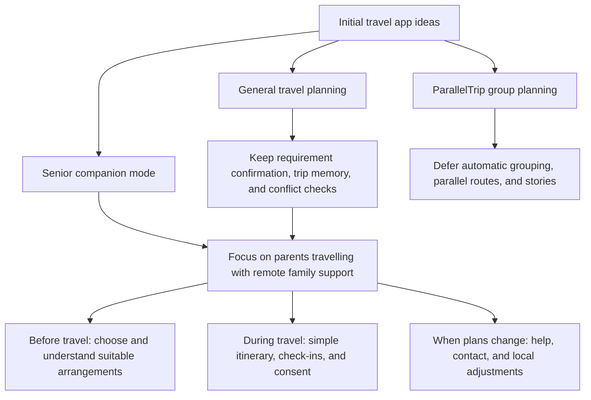
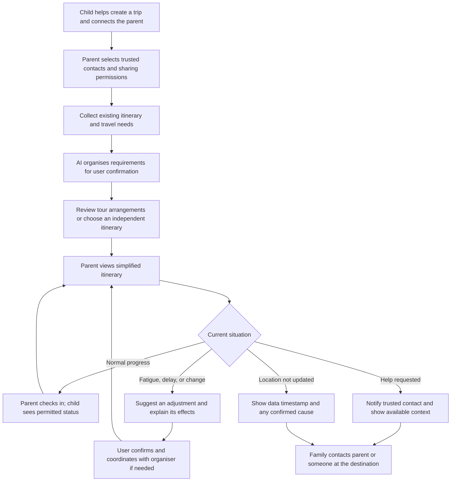
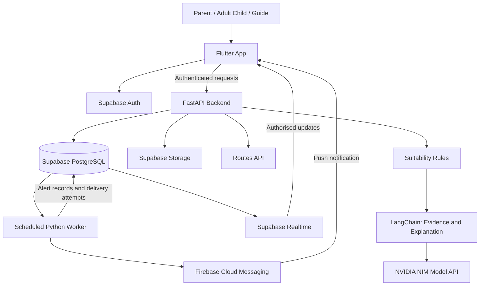

# Senior Travel Companion

A travel assistance app for adult children who cannot personally accompany their older parents on a trip.

This document covers **1. Project Overview**, **2. Ideation & Process**, **3. Design & Prototype**, **4. What Makes It Different**, and **5. Architecture & Feasibility** from the Submission Template. The product capabilities remain proposals; Section 3 presents a visual UI prototype with sample data and basic screen navigation. It has not yet been validated with older users.

**Review the design:** [Design and prototype](#3-design--prototype) · [Key screens](#key-screens) · [Preview route](#preview-route)

## 1. Project Overview

### The Problem

Adult children who cannot accompany their older parents still want to help them choose a suitable trip and get assistance when something changes. This requires more than a booking confirmation or a location pin: families need to understand whether the itinerary fits the parent, what should be happening during the trip, and who can help locally.

**Primary users and intended payers:** adult children. **End users:** parents aged 60 and above. The initial concept focuses on organised tours, where a guide can provide local support; independent travel would require a separately agreed local contact.

| Pain Point | A Family's Question | Proposed Response |
| --- | --- | --- |
| Tour suitability is difficult to judge for an individual parent. | Can Mum keep up if she cannot walk for long? | Match the parent's walking tolerance, rest needs, language and budget against tour details, with reasons and mismatches. |
| Important tour information is scattered or incomplete. | Who is the guide? Does the hotel have a lift? What does the insurance cover? | Bring guide credentials, licence details, insurance, hotels, transport and itinerary information into a Tour Trust Profile, with sources and missing information clearly shown. |
| Remote children lack context when a parent does not reply. | Is Dad enjoying an activity, running late, or asking for help? | Combine the itinerary with check-ins, requests and the latest available status in a Child Dashboard. |
| Busy travel interfaces make simple actions harder. | Where do I go next, and how do I tell my family I am okay? | Offer Senior Simple Mode with the next stop, meeting reminder, I'm OK and help actions. |
| Responsibility is unclear when plans go wrong. | I am far away. Who can check on Mum, and has anyone responded? | Propose itinerary-related alerts to the authorised child and guide, with recipient and acknowledgement status. |

These are problem hypotheses to validate with older travellers, adult children and tour operators. A missed response alone does not establish that someone is in danger.

Existing products address parts of this journey: TourRadar helps travellers discover tours, TripIt organises and shares itineraries, and Life360 supports family location sharing and SOS alerts. Our proposed focus is connecting parent-specific tour selection with support during the trip; the comparison and sources appear in [Section 4](#4-what-makes-it-different).

### Our Solution

**We help adult children choose suitable tours for their older parents and coordinate support with tour guides throughout the trip.**

An AI Senior Travel Advisor would compare a Parent Profile with tour, guide, itinerary and safety information to explain suitability, highlight mismatches and identify missing evidence. A Tour Trust Profile would make the supporting information easier to inspect before choosing a tour. During travel, children would follow an itinerary-aware dashboard while parents use a simple interface to see the next step, check in or request help. With the parent's permission, relevant alerts would connect the family with an agreed local guide or contact.

The proposed feature set is **AI Senior Tour Matcher**, **Tour Trust Profile**, **Child Dashboard**, **Senior Simple Mode**, and **Smart Safety Alerts**, supported by an **AI Senior Travel Advisor and explainable Suitability Score**. The Child Dashboard now also includes a **Trip Map Preview** that demonstrates a future consent-based location-sharing experience. The current prototype uses sample data and an illustrative map; it does not perform matching, verification, live tracking or safety monitoring.

## 2. Ideation & Process

### Product Direction and Target Users

We want to help adult children support their parents before and during a trip, even when they cannot travel together. Children can help choose suitable arrangements, understand the daily itinerary, and respond when their parents are running late, need rest, or request assistance. Parents may join an organised tour or travel independently.

| Role | Position | Core Needs |
| --- | --- | --- |
| Adult children | Primary users and intended payers | Help select suitable itineraries, understand trip progress, and know how to assist when plans change. |
| Parents aged 60 and above | End users and actual travellers | Understand what to do next, check in or request help easily, and control what information they share. |
| Authorised family members or local contacts | Supporting users, such as siblings, accompanying relatives, or tour organisers | View permitted information and help with communication or issues at the destination. |

A **Trusted Companion** is a contact authorised by the parent. This person may be an adult child helping remotely or someone travelling with the parent. The app must distinguish these roles: it cannot assume that a child is physically present, and creating a trip does not automatically grant access to a parent's location.

**Core question:** How might we help older parents understand and manage their trip while enabling useful remote support from their adult children, with parents remaining in control of their information and decisions?

Our initial problem hypotheses concern whether itineraries suit parents' stamina and preferences, whether complex schedules are difficult to follow, whether families need to repeatedly ask for updates, and whether changes are difficult to communicate. These hypotheses require interviews with parents and adult children.

### 2.1 Ideas We Considered

The initial draft explored general travel planning, ParallelTrip group itineraries, and a senior companion mode. Our current direction centres on Senior Travel Companion, retaining capabilities that directly support parents travelling and families helping remotely. The decisions below reflect this proposed scope.

| Idea | Decision | Reason for Keeping, Adapting, or Deferring |
| --- | --- | --- |
| **AI Senior Tour Matcher (Chosen)** | Add to the core direction | Uses a parent profile to present suitable tour options with clear trade-offs. The UI currently uses fixed sample matches. |
| **Tour Trust Profile (Chosen)** | Add to the core direction | Makes guide, licence, insurance, hotel, transport, and safety information visible, including missing information and verification status. |
| **AI Senior Travel Advisor and Suitability Score (Chosen)** | Add to the core direction | Combines parent, tour, guide, itinerary, and safety information into an explainable suitability assessment. It is not a safety guarantee. |
| **Smart Safety Alerts to Guide and Child (Chosen)** | Add as a visual concept | Shows route deviation, overdue check-in, and SOS scenarios with guide and child recipients. Detection and delivery are not implemented. |
| **Parent travel with remote family support (Chosen)** | Core direction | Serves families who cannot travel together, connecting preparation, trip awareness, and assistance when something changes. |
| **Shared family trip space and authorised contacts (Chosen)** | Keep | Connects parents, children, and relevant contacts to one itinerary, with roles and information permissions managed separately. |
| **AI requirement extraction with user confirmation (Chosen)** | Keep | Organises budget, interests, dietary needs, walking limits, and rest preferences from discussions. Users confirm, edit, or reject suggestions before they become decisions. |
| **Living Trip Memory (Chosen)** | Keep and focus | Distinguishes tentative suggestions, confirmed preferences, hard constraints, rejection reasons, and booked arrangements so revisions respect prior decisions. |
| **Suitable itinerary selection and feasibility checks (Chosen)** | Adapt | Compares walking demands, rest opportunities, transport, costs, and fixed times. For organised tours, focuses on understanding the existing schedule and identifying details to confirm. |
| **Simplified itinerary for parents (Chosen)** | Keep | Highlights the next activity, departure or meeting time, estimated walking time, and clear actions for checking in, requesting help, and contacting family. |
| **Consent-based status and location sharing (Chosen)** | Keep | Parents choose recipients, location precision, and sharing duration, and can stop sharing. Remote assistance relies on explicit permission. |
| **Check-ins and contextual trip status (Chosen)** | Keep | Communicates arrival, wellbeing, delays, or requests for help, with timestamps that make updates understandable. |
| **Help requests and contact actions (Chosen)** | Keep | Lets parents quickly request assistance while authorised contacts see relevant itinerary details and permitted location information. |
| **Route deviation and unavailable location explanations (Chosen)** | Keep for prototype demonstration | Distinguishes possible deviation, stale data, and unavailable location. Simulated GPS can demonstrate the interaction and test how families interpret it. |
| **Minimal-change replanning with before-and-after comparison (Chosen)** | Adapt | Changes affected activities when parents are tired, delayed, or affected by rain, while aiming to preserve bookings, pickups, and meeting times. Users review changes before confirming. |
| Itinerary and check-in reminders | Secondary priority | May reduce forgotten activities or updates. Local reminders can follow once the core journey works. |
| Basic budget tracking and transport cost estimates | Secondary priority | Supports itinerary decisions, but detailed expense management is outside the core scope. Costs must be labelled as estimates. |
| Separate general travel and senior modes | Defer | Focuses the initial experience on one clear family use case. |
| ParallelTrip automatic grouping, Fork Windows, multiple Parallel Tracks, and reunion-point optimisation | Defer | Primarily addresses different interests within groups travelling together. The current use case needs fixed meeting arrangements without depending on parallel group planning. |
| Mandatory accompanying companion for every older traveller | Adapt to individual trip needs | Independent travel is part of the target scenario. Where in-person support is needed, an actual accompanying contact must be arranged rather than assumed. |
| Parallel Story, branching timelines, What You Missed, and shared travel stories | Defer | These support memories and sharing; they can be reconsidered after the remote assistance experience is validated. |
| Public social platform, real payments, hotel and flight booking, and full WhatsApp integration | Exclude from this phase | Adds substantial business and integration scope before the value of family travel assistance has been tested. |
| Automatic emergency dispatch, ambulance calls, medical monitoring, and fall detection | Exclude from product promises | The concept provides travel information, help requests, and contact options. It does not promise automatic rescue or medical assessment. |

#### How the Core Experience Connects

**Before the trip: agree on suitable arrangements.** Adult children help create a trip with its destination, dates, budget, and members. Together with their parents, they confirm interests, dietary needs, walking limits, and rest preferences. AI presents extracted requirements for confirmation before using them in itinerary suggestions. For an organised tour, the family records the existing itinerary and fixed meeting points. For independent travel, the app can propose itineraries for comparison. Budget or timing conflicts should come with understandable alternatives for users to choose from.

**During the trip: parents know what comes next, and children understand the current situation.** The parent's view highlights the next activity, departure or meeting time, and estimated walking time. Actions include "I have arrived", "I am okay", "I am running late", "I need help", and "Call trusted companion". The child's view shows itinerary progress, the latest check-in, update times, and items needing attention. Location appears only within the parent's permissions.

**When plans change: understand the situation and agree on an adjustment.** Parents can report fatigue, delays, or a need for help. The app uses the itinerary to suggest options such as taking a rest, contacting the tour organiser, or returning to a meeting point. It explains changes to activities, walking, estimated costs, and timing before users confirm. Changes affecting an organised tour require coordination with the organiser; editing the app's itinerary does not mean the tour has accepted the change.

#### Consent and Meaningful Status Information

- Parents choose trusted contacts and whether to share status only, approximate location, or precise location. Sharing can be limited to the trip or triggered by route deviation, and parents can stop it.
- "On track", "Check-in due", "Possibly off route", "Running late", "Help requested", and "Location unavailable" represent different situations. Missing location updates must not automatically be interpreted as danger.
- Every status shows its last update time. Causes such as lost connectivity, unavailable GPS, low battery, or stopped sharing are identified only when supported by available information. Otherwise, the app states that the cause is unknown or the data is stale.
- A help request shows the current itinerary, next meeting point, and last known location when available and authorised. Contact options help the family act without implying that emergency services have been notified or dispatched.
- Suggested routes may prioritise shorter walks, rest stops, fewer stairs, and nearby toilets. Accessibility information must include its source or be marked as requiring confirmation; AI inference alone cannot guarantee accessibility.

### 2.2 Ideation Boards

The following diagrams organise the draft ideas and current product direction. They illustrate the proposed concept and user journey rather than completed workshops or user testing. Both diagrams are embedded in this Markdown file using Mermaid.

#### From Initial Ideas to a Focused Concept

This diagram shows how the broader travel concept narrows to families who cannot travel together. General planning capabilities support the senior experience, while parallel group planning remains deferred.

#### Family Support User Journey

The journey distinguishes routine check-ins, changed plans, explicit help requests, and missing location updates. Adult children assist remotely; action at the destination requires contact with the parent or someone physically present.

#### Example of a Local Itinerary Adjustment

A parent feels tired and wants to rest nearby while keeping a 1:00 PM lunch meeting. The figures below are illustrative values from the concept draft, not verified venue information or live prices.

| Item | Original Plan | Proposed Adjustment |
| --- | --- | --- |
| Activity | Visit a museum | Rest at a nearby cafe; suitability for the parent requires confirmation. |
| Estimated walking time | 22 minutes | 8 minutes |
| Estimated activity cost | RM15 | RM12 |
| Lunch meeting time | 1:00 PM | 1:00 PM, subject to checking transport and arrival time. |

The app should explain why it suggests the adjustment, which arrangements remain in place, and what still needs confirmation. For organised tours, the family coordinates with the organiser before updating the parent's confirmed itinerary.

#### Initial Prototype Validation

The first prototype should demonstrate one complete trip journey: requirement confirmation, a simplified itinerary, authorised sharing and check-ins, a help request or simulated route deviation, and confirmation of a local adjustment. We will first test whether both generations can understand and use this experience before expanding into budget tools, reminders, or other features.

| Question to Validate | Proposed Method |
| --- | --- |
| Can parents independently find their next activity, check in, and request help? | Ask parents to complete specific tasks and observe whether they need explanation or assistance. |
| Can children distinguish a missed check-in, stale location, and a help request? | Present different status scenarios and ask what each means and what action they would take. |
| Do parents understand and accept sharing controls? | Ask parents to select recipients, precision, and duration, then stop sharing. |
| Does AI accurately capture requirements and preserve important constraints? | Use a discussion containing tentative suggestions and confirmed decisions to test confirmation, editing, and replanning. |
| Does the support model fit both organised tours and independent travel? | Interview families with experience of each, checking which arrangements can change and whom they need to contact. |
| Would adult children continue using or pay for the app? | Explore travel frequency, current support methods, and willingness to pay. Intended payers are not yet validated customers. |

### 2.3 Mentor Consultation

The following mentor feedback shaped the project direction and scope.

| Date | Mentor | Feedback Received | What Was Changed |
| --- | --- | --- | --- |
| 9 Sep 2026, 21:15 | Lim Zi Yang | The idea felt too common. Focus on a specific user experience. | Reframed the ideation approach and changed the initial concept. |
| 10 Sep 2026, 21:50 | Kueh Pang Teng | Explore one specific idea in greater depth and support it with deeper research. | Narrowed multiple ideas to one main concept: Senior Travel Companion. Expanded the research around this user group and problem. |

Consultation should explore whether the family use case is focused enough, whether the parent experience is simple, whether remote and in-person responsibilities are clear, and whether the initial prototype scope is feasible.

## 3. Design & Prototype

**UI concept only.** All screens are in English. Tours, profiles, scores, credentials, and alerts are illustrative. This version focuses on visual design and basic screen navigation, with no backend or live services.

### Open the Prototype

Open [prototype/index.html](prototype/index.html) after downloading the repository. Keep the four source files and the `assets` folder together inside `prototype`. No installation is needed. GitHub shows HTML as source; download it to view the interface.

### Screens Included

| Feature | UI Coverage |
| --- | --- |
| AI Senior Tour Matcher | Parent summary, tour cards, pace and budget filters, sample match scores. |
| Parent Profile | Age, walking comfort, rest frequency, language, budget, and travel preferences. |
| Tour Trust Profile | Guide information, licence, operator registration, insurance, hotel, transport, safety plan, source and review status. |
| AI Senior Travel Advisor | Five information inputs, illustrative suitability score, match breakdown, strengths and questions to clarify. |
| Child Dashboard | Current itinerary, sample status, map preview, next meeting, guide contact and safety centre. |
| Trip Map Preview — future feature | Illustrative George Town route, shared parent/group location, next stop, update time and parent-controlled sharing explanation. |
| Senior Simple Mode | Next stop, meeting reminder, I'm OK, guide contact and SOS/help. |
| Smart Safety Alerts | Off-route, no-response and SOS screens, with guide and child recipient states. |

### Key Screens

These screenshots show mobile viewports. Select an image to enlarge it; scroll within the prototype for additional details.

| Tour matching | Parent profile |
| --- | --- |
|  |  |
| Short tour summaries and visible match scores. | Preferences are grouped into simple choices. |

| Tour details | Tour trust profile |
| --- | --- |
|  |  |
| The trip's important details appear before the next action. | Expand a row to see sources and information that needs confirmation. |

| AI travel advisor | Child dashboard |
| --- | --- |
|  |  |
| Suitability is explained separately from credential verification. | Status, illustrative shared location, itinerary and contact actions stay together. |

| Senior simple mode | Smart safety alerts |
| --- | --- |
|  |  |
| Short labels, a clear next stop and large actions. | Three selectable scenarios show who would receive an alert. |

### Preview Route

1. Start in **Family view**. Open a tour from **Discover**.
2. Select **Why this score** to preview the advisor, or **Tour trust profile** to inspect the information rows.
3. Open **My trip** for the sample Penang dashboard. Select the map card to preview the proposed shared-location view, then open **Alerts** for the three safety scenarios.
4. Switch to **Parent view** for the simplified home. Open **SOS / Help**, **My day**, or **Contacts**.
5. On desktop, the left navigation provides shortcuts to the six main concepts.

### Visual Direction

- Smaller, consistent headings and less bold text reduce visual competition.
- Family screens use compact cards; parent screens retain larger text and touch targets.
- Repeated explanations are removed. Additional trust information is expandable.
- The parent homepage keeps its main actions visible at the checked 390px mobile width.
- Statuses use text as well as colour. Controls retain visible keyboard focus.

The design continues to draw on [W3C's older-user guidance](https://www.w3.org/WAI/older-users/), [WCAG target-size guidance](https://www.w3.org/WAI/WCAG22/Understanding/target-size-enhanced.html), and [NN/g's older-adult usability research](https://www.nngroup.com/articles/usability-for-senior-citizens/). It has not been validated with older users or audited for full accessibility conformance.

### Prototype Boundaries

This is a screen design, not a functional service. Profile edits do not recalculate scores, tour browsing does not book or enrol a traveller, and the active-trip preview remains a sample Penang journey. The map is an AI-generated illustration used to demonstrate a future feature; it is not a navigational map and does not show a live location. Alert detection, delivery, acknowledgement, reminders, GPS, AI scoring, calls and credential verification are not connected. Refreshing or resetting returns to the sample state.

## 4. What Makes It Different

### Comparison with Existing Apps

Senior tours, itinerary sharing and SOS features already exist. Our proposed distinction is how these capabilities support one specific relationship: an older parent travelling, an adult child helping remotely, and a guide providing support at the destination. This comparison describes product positioning, not proof that competing products lack every overlapping feature.

| Existing Product | Relevant Capabilities | Our Proposed Focus |
| --- | --- | --- |
| **TourRadar** | Offers [senior tours](https://www.tourradar.com/pa/seniors) and uses [guide types and physical ratings](https://help.tourradar.com/en/operators/group-type-guide-type-physical-ratings) to describe tours. | Assess a tour against an individual parent's profile and explain the fit, unsuitable activities and information still needed. Continue supporting the family after tour selection. |
| **TripIt** | [Organises travel plans and lets users share itineraries](https://help.tripit.com/en/support/solutions/articles/103000063304-getting-started) with family and others. | Connect the itinerary to a parent's check-ins, rest requests and guide contact, so remote children can understand the situation and coordinate assistance. |
| **Life360** | Provides [family location sharing](https://www.life360.com/location-sharing) and [SOS alerts to Circle members and emergency contacts](https://support.life360.com/hc/en-us/articles/23053474049687-SOS-Alerts). | Interpret proposed alerts in the context of a planned tour, such as a missed meeting, and distinguish the guide's local response from the child's remote support. |

### The Proposed Difference

1. **Personal suitability before the trip.** The advisor would combine Parent Profile + Tour Information + Guide Information + Itinerary + Safety Information. A Suitability Score would include reasons, potential difficulties and unknowns, helping families assess the recommendation rather than rely on a number alone.
2. **Suitability and trust shown separately.** Suitability concerns whether a trip fits this parent. Trust information concerns the source and verification status of tour details. A comfortable itinerary does not prove that credentials are verified, and neither a score nor a profile guarantees safety.
3. **Connected support throughout the journey.** Tour selection, itinerary context, parent check-ins and guide communication would share one trip context, reducing the information families need to piece together across separate tools.
4. **Different interfaces for different roles.** Children can inspect detailed comparisons and trip status. Parents get short instructions and prominent actions. Guides would receive the context needed to respond locally, subject to agreed responsibilities and the parent's sharing permissions.

### Example: From Choosing a Tour to Getting Help

A daughter records that her mother prefers walking for no more than 20 minutes at a time. Before booking, the proposed advisor flags a tour segment involving 40 minutes of continuous walking and suggests checking whether transport or a rest alternative is available. During the trip, if her mother selects **Need a rest**, the proposed shared trip view gives the daughter and authorised guide the current activity context. The guide can assist locally, while the daughter can see whether the request has been acknowledged.

This illustrates the intended value: **help families choose a suitable trip, understand what is happening, and coordinate the next action.** The matching and response workflow remain proposed capabilities. Interviews and usability testing are needed to establish whether this combination addresses a meaningful gap and whether families would pay for it.

## 5. Architecture & Feasibility

### Proposed Technology Stack

The planned implementation uses **Flutter + FastAPI + LangChain + NVIDIA NIM + a Routes API + Supabase**. The current prototype is HTML, CSS and JavaScript; the stack below describes the next implementation phase, not services already connected to the demo. “Route API” is treated as a routing service category, with Google Maps Routes API as the proposed provider pending coverage, pricing and access checks.

| Layer | Technology | Purpose in Our App |
| --- | --- | --- |
| Frontend | **Flutter / Dart** | Build parent, child and guide experiences from a shared mobile codebase, with a web preview for reviewers. Parent screens prioritise large controls, readable text and short steps. [Flutter platform support](https://docs.flutter.dev/platform-integration/web) |
| Backend | **FastAPI / Python + Pydantic** | Provide APIs for profiles, tours, matching, trips, check-ins and alerts. Validate request and response schemas and enforce trip permissions before accessing data. |
| AI orchestration | **LangChain** | Assemble relevant tour evidence and parent preferences, call the model, and return structured explanations with source references. Validate outputs before displaying them; structured-output support must be tested with the selected model. [LangChain documentation](https://docs.langchain.com/oss/python/langchain/structured-output) |
| AI inference API | **NVIDIA NIM** | Use a selected hosted language model endpoint to summarise itinerary information and explain suitability. Start with hosted inference, subject to model access and quotas, rather than requiring a team-operated GPU server. [NVIDIA hosted model APIs](https://docs.api.nvidia.com/nim/re/reference/llm-apis) |
| Routing API | **Google Maps Routes API — proposed** | Retrieve route distances and estimated travel durations for itinerary checks. Walking estimates are inputs to suitability, not proof of accessible paths or an individual parent's walking speed. [Routes API](https://developers.google.com/maps/documentation/routes/reference/rest/v2/TopLevel/computeRoutes) |
| Database and managed services | **Supabase: PostgreSQL, Auth, Storage and Realtime** | Store structured trip data, authenticate users, retain supporting documents and update authorised dashboards when trip records change. [Supabase database overview](https://supabase.com/docs/guides/database/overview) |
| Geospatial support | **PostGIS in Supabase — later phase** | Compare consented location samples against expected meeting areas or route corridors. Combine distance with sample age, accuracy and itinerary timing before raising a possible deviation. [Supported extensions](https://supabase.com/docs/guides/database/overview) |
| Notifications | **Firebase Cloud Messaging (FCM)** | Send push notifications to authorised child and guide devices. Realtime updates serve open dashboards; push notifications provide a separate device notification channel. [FCM documentation](https://firebase.google.com/docs/cloud-messaging) |
| Scheduled processing | **Python worker + PostgreSQL job/outbox tables** | Evaluate overdue check-ins and process persisted notification jobs with retries and duplicate prevention. Keep alert processing independent of model availability. |

FCM and a persistent worker fill the main gaps in the proposed core stack: notifying users away from the dashboard and evaluating time-based events. PostGIS can wait until location-based alerts are tested; a vector database is not necessary for a small, curated tour catalogue.

### System Architecture

FastAPI verifies the user's identity and trip role on every protected request. Supabase Row Level Security restricts client-accessible records and subscriptions to authorised trip members; privileged backend credentials remain server-side and require explicit backend authorisation checks. Parent consent determines which contacts can access location and status information. [Supabase RLS documentation](https://supabase.com/docs/guides/database/postgres/row-level-security)

### How the Core Features Would Work

| Feature | Implementation Approach | Important Boundary |
| --- | --- | --- |
| AI Senior Tour Matcher and Advisor | Filter a curated tour catalogue against parent requirements. Use explicit, versioned rules to calculate fit, then use LangChain and NIM to explain the result using supplied evidence. | The model does not invent the score, tour details or medical advice. Missing essential information produces a needs-review result rather than an apparently precise recommendation. |
| Tour Trust Profile | Store guide, operator, insurance, hotel and transport records with source, review status and last-reviewed date. Link supporting documents from private storage. | Uploaded or operator-provided information is not automatically verified. Verification requires an agreed evidence-review process. |
| Child Dashboard | Read itinerary events, check-ins and help requests from Supabase, with permitted Realtime subscriptions. | Always show the latest event timestamp; stale data must not appear as a current status. |
| Senior Simple Mode | Present the next activity and a small set of actions in Flutter. Cache essential itinerary and contact information locally. | Offline check-ins remain visibly pending until the backend confirms receipt. |
| Smart Safety Alerts | Persist SOS requests immediately; use the worker for overdue check-ins and, later, repeated location deviations. Create separate recipient and acknowledgement records for the child and guide. | Device push acceptance does not mean the recipient has read or acted on an alert. Background location requires permissions and device testing. |

For the initial matcher, compare walking duration, rest opportunities, language, budget and declared accessibility requirements. Known conflicts with a required condition must be shown explicitly rather than averaged away by other preferences. Display evidence completeness separately from suitability, and use a rule-based explanation if the model endpoint is unavailable.

The main data entities are **profiles, tours, guides, tour evidence, itinerary events, trips, trip memberships and consent, check-ins, help requests, alerts, notification attempts and acknowledgements**. Location samples are optional, consent-based records with timestamps and accuracy. Each alert can have multiple recipients, so a guide's acknowledgement does not imply that the child has responded.

### Feasibility and Delivery Scope

A bounded MVP is technically plausible because the core workflow uses structured records, explicit matching rules and managed services. The largest uncertainties are the quality of tour information, reliable mobile background behaviour, and whether guides can commit to responding. Feasibility still needs to be demonstrated through integration and user testing.

| Stage | Scope | Evidence of Completion |
| --- | --- | --- |
| Current prototype | Sample tours, fixed scores, role-specific screens and simulated alert scenarios. | Reviewers can navigate the proposed experience; no live integration is claimed. |
| First working MVP | Flutter app, FastAPI, Supabase authentication and trip data, a small curated tour catalogue, rule-based matching, NIM explanations and manual check-ins/help requests. | An authorised child can create a parent profile, inspect a match and see a parent check-in from another device. |
| Alert pilot | Persistent alert jobs, FCM, recipient acknowledgements and overdue check-in rules. | Test devices receive a controlled alert; retrying does not duplicate it, and each recipient's response is recorded separately. |
| Later validation | Consented background location, PostGIS deviation checks, broader operator data and older-adult usability testing. | Evaluate battery use, stale-location handling, false alerts and successful task completion before broader rollout. |

### Key Constraints and Mitigations

- **Tour data availability:** start with manually reviewed sample or partner-provided tours. A routing API cannot supply guide credentials, insurance terms or hotel accessibility evidence.
- **AI reliability:** send only the relevant, consented profile fields and source records; validate returned fields and references. Keep scoring and alert triggers in deterministic backend logic.
- **Connectivity and notification delivery:** cache essential trip information, show pending and stale states, and persist jobs for retry. Provide contact actions because a notification service cannot guarantee a human response.
- **Access and privacy:** enforce trip membership and parent consent, protect supporting documents, and define retention for location data. Test that one family's account cannot read another family's trip.
- **Cost and deployment:** use one FastAPI service and one worker with managed Supabase and hosted inference initially. Confirm model access, route API billing, quotas and hosting costs before committing to a budget; apply request limits and cache only where provider terms permit.
- **Validation:** test profile-to-tour mismatches, missing evidence, model failure, revoked access, duplicate alerts and offline recovery. Validate the parent interface with older adults rather than assuming larger buttons alone make it usable.
