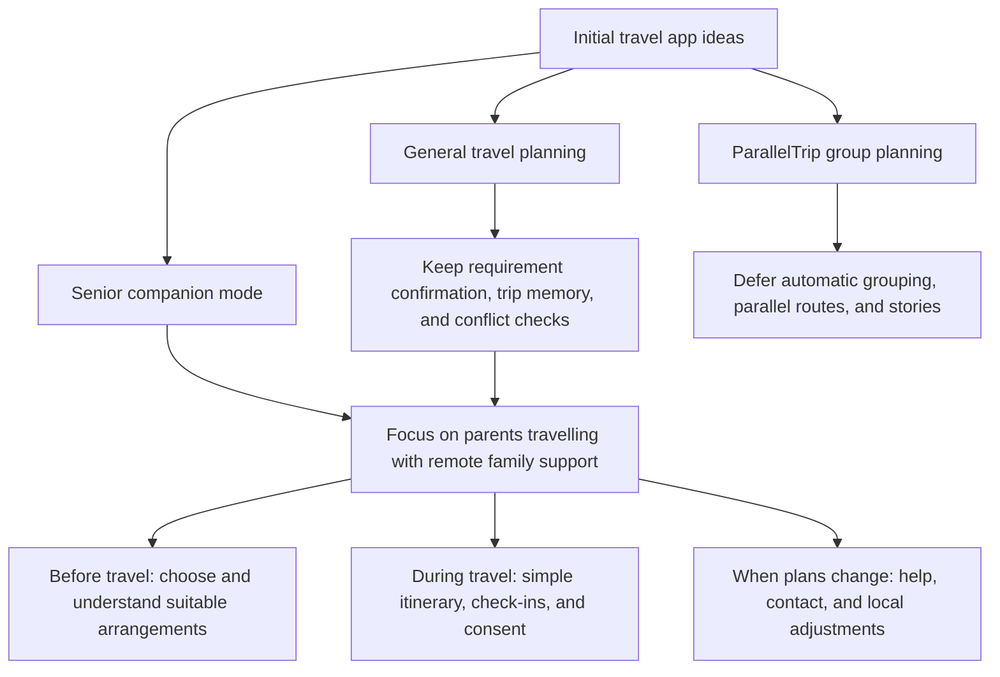
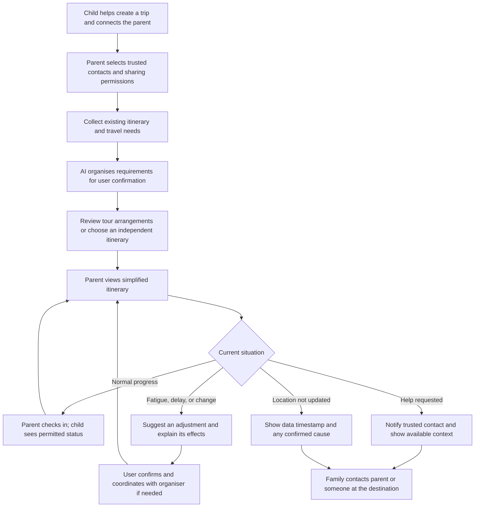
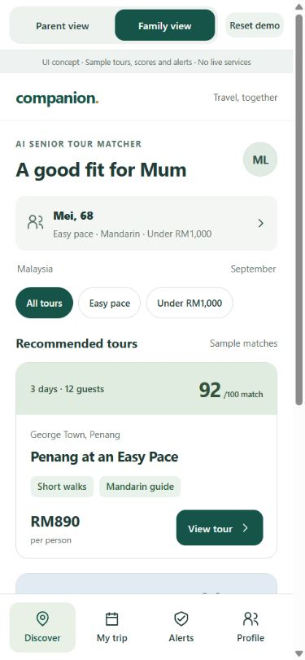
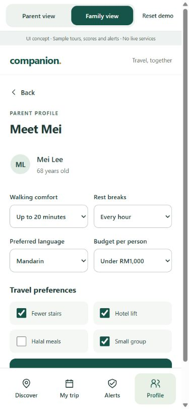
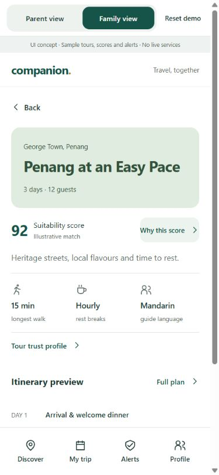
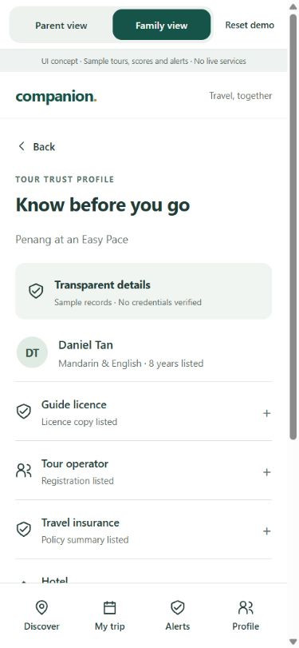
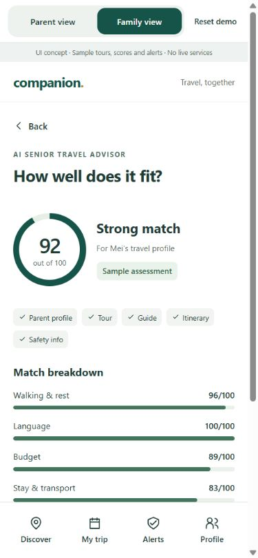
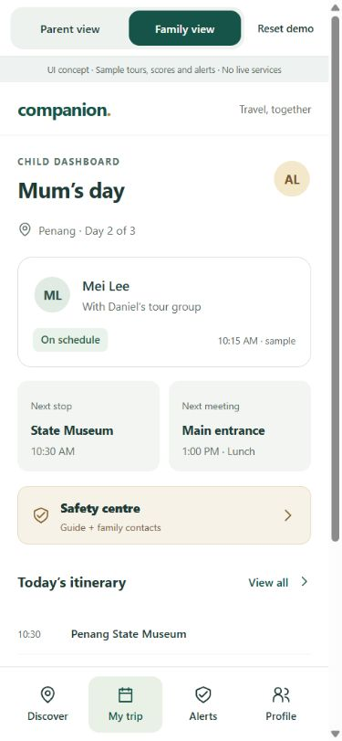
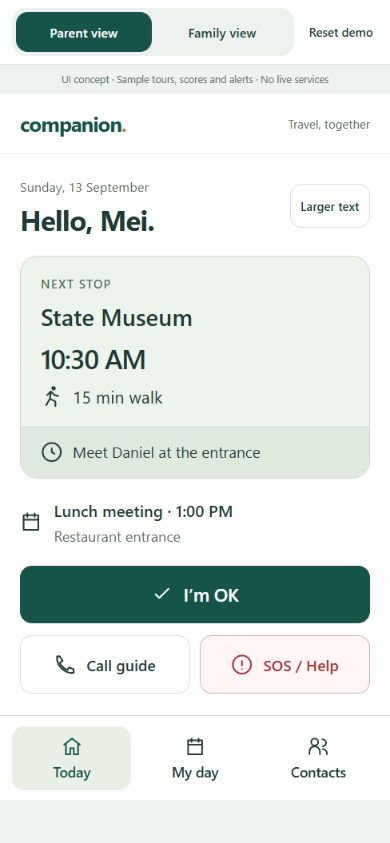
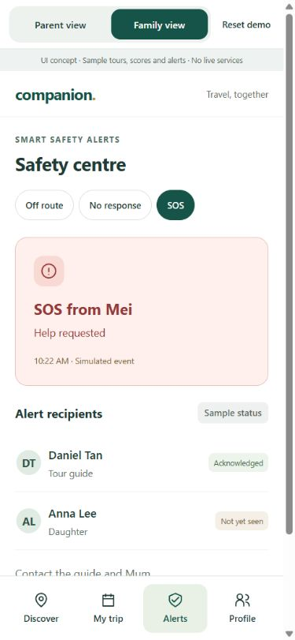

# Senior Travel Companion

A travel assistance app for adult children who cannot personally accompany their older parents on a trip.

This document covers **2. Ideation & Process** and **3. Design & Prototype** from the Submission Template. The product capabilities remain proposals; Section 3 presents a visual UI prototype with sample data and basic screen navigation. It has not yet been validated with older users.

**Review the design:** [Design and prototype](#3-design--prototype) · [Key screens](#key-screens) · [Preview route](#preview-route)

## 2. Ideation & Process

### Product Direction and Target Users

We want to help adult children support their parents before and during a trip, even when they cannot travel together. Children can help choose suitable arrangements, understand the daily itinerary, and respond when their parents are running late, need rest, or request assistance. Parents may join an organised tour or travel independently.

| Role | Position | Core Needs |
| --- | --- | --- |
| Adult children | Primary users and intended payers | Help select suitable itineraries, understand trip progress, and know how to assist when plans change. |
| Parents aged 60 and above | End users and actual travellers | Understand what to do next, check in or request help easily, and control what information they share. |
| Authorised family members or local contacts | Supporting users, such as siblings, accompanying relatives, or tour organisers | View permitted information and help with communication or issues at the destination. |

A **Trusted Companion** is a contact authorised by the parent. This person may be an adult child helping remotely or someone travelling with the parent. The app must distinguish these roles: it cannot assume that a child is physically present, and creating a trip does not automatically grant access to a parent's location.

**Core question:** How might we help older parents understand and manage their trip while enabling useful remote support from their adult children, with parents remaining in control of their information and decisions?

Our initial problem hypotheses concern whether itineraries suit parents' stamina and preferences, whether complex schedules are difficult to follow, whether families need to repeatedly ask for updates, and whether changes are difficult to communicate. These hypotheses require interviews with parents and adult children.

### 2.1 Ideas We Considered

The initial draft explored general travel planning, ParallelTrip group itineraries, and a senior companion mode. Our current direction centres on Senior Travel Companion, retaining capabilities that directly support parents travelling and families helping remotely. The decisions below reflect this proposed scope.

| Idea | Decision | Reason for Keeping, Adapting, or Deferring |
| --- | --- | --- |
| **AI Senior Tour Matcher (Chosen)** | Add to the core direction | Uses a parent profile to present suitable tour options with clear trade-offs. The UI currently uses fixed sample matches. |
| **Tour Trust Profile (Chosen)** | Add to the core direction | Makes guide, licence, insurance, hotel, transport, and safety information visible, including missing information and verification status. |
| **AI Senior Travel Advisor and Suitability Score (Chosen)** | Add to the core direction | Combines parent, tour, guide, itinerary, and safety information into an explainable suitability assessment. It is not a safety guarantee. |
| **Smart Safety Alerts to Guide and Child (Chosen)** | Add as a visual concept | Shows route deviation, overdue check-in, and SOS scenarios with guide and child recipients. Detection and delivery are not implemented. |
| **Parent travel with remote family support (Chosen)** | Core direction | Serves families who cannot travel together, connecting preparation, trip awareness, and assistance when something changes. |
| **Shared family trip space and authorised contacts (Chosen)** | Keep | Connects parents, children, and relevant contacts to one itinerary, with roles and information permissions managed separately. |
| **AI requirement extraction with user confirmation (Chosen)** | Keep | Organises budget, interests, dietary needs, walking limits, and rest preferences from discussions. Users confirm, edit, or reject suggestions before they become decisions. |
| **Living Trip Memory (Chosen)** | Keep and focus | Distinguishes tentative suggestions, confirmed preferences, hard constraints, rejection reasons, and booked arrangements so revisions respect prior decisions. |
| **Suitable itinerary selection and feasibility checks (Chosen)** | Adapt | Compares walking demands, rest opportunities, transport, costs, and fixed times. For organised tours, focuses on understanding the existing schedule and identifying details to confirm. |
| **Simplified itinerary for parents (Chosen)** | Keep | Highlights the next activity, departure or meeting time, estimated walking time, and clear actions for checking in, requesting help, and contacting family. |
| **Consent-based status and location sharing (Chosen)** | Keep | Parents choose recipients, location precision, and sharing duration, and can stop sharing. Remote assistance relies on explicit permission. |
| **Check-ins and contextual trip status (Chosen)** | Keep | Communicates arrival, wellbeing, delays, or requests for help, with timestamps that make updates understandable. |
| **Help requests and contact actions (Chosen)** | Keep | Lets parents quickly request assistance while authorised contacts see relevant itinerary details and permitted location information. |
| **Route deviation and unavailable location explanations (Chosen)** | Keep for prototype demonstration | Distinguishes possible deviation, stale data, and unavailable location. Simulated GPS can demonstrate the interaction and test how families interpret it. |
| **Minimal-change replanning with before-and-after comparison (Chosen)** | Adapt | Changes affected activities when parents are tired, delayed, or affected by rain, while aiming to preserve bookings, pickups, and meeting times. Users review changes before confirming. |
| Itinerary and check-in reminders | Secondary priority | May reduce forgotten activities or updates. Local reminders can follow once the core journey works. |
| Basic budget tracking and transport cost estimates | Secondary priority | Supports itinerary decisions, but detailed expense management is outside the core scope. Costs must be labelled as estimates. |
| Separate general travel and senior modes | Defer | Focuses the initial experience on one clear family use case. |
| ParallelTrip automatic grouping, Fork Windows, multiple Parallel Tracks, and reunion-point optimisation | Defer | Primarily addresses different interests within groups travelling together. The current use case needs fixed meeting arrangements without depending on parallel group planning. |
| Mandatory accompanying companion for every older traveller | Adapt to individual trip needs | Independent travel is part of the target scenario. Where in-person support is needed, an actual accompanying contact must be arranged rather than assumed. |
| Parallel Story, branching timelines, What You Missed, and shared travel stories | Defer | These support memories and sharing; they can be reconsidered after the remote assistance experience is validated. |
| Public social platform, real payments, hotel and flight booking, and full WhatsApp integration | Exclude from this phase | Adds substantial business and integration scope before the value of family travel assistance has been tested. |
| Automatic emergency dispatch, ambulance calls, medical monitoring, and fall detection | Exclude from product promises | The concept provides travel information, help requests, and contact options. It does not promise automatic rescue or medical assessment. |

#### How the Core Experience Connects

**Before the trip: agree on suitable arrangements.** Adult children help create a trip with its destination, dates, budget, and members. Together with their parents, they confirm interests, dietary needs, walking limits, and rest preferences. AI presents extracted requirements for confirmation before using them in itinerary suggestions. For an organised tour, the family records the existing itinerary and fixed meeting points. For independent travel, the app can propose itineraries for comparison. Budget or timing conflicts should come with understandable alternatives for users to choose from.

**During the trip: parents know what comes next, and children understand the current situation.** The parent's view highlights the next activity, departure or meeting time, and estimated walking time. Actions include "I have arrived", "I am okay", "I am running late", "I need help", and "Call trusted companion". The child's view shows itinerary progress, the latest check-in, update times, and items needing attention. Location appears only within the parent's permissions.

**When plans change: understand the situation and agree on an adjustment.** Parents can report fatigue, delays, or a need for help. The app uses the itinerary to suggest options such as taking a rest, contacting the tour organiser, or returning to a meeting point. It explains changes to activities, walking, estimated costs, and timing before users confirm. Changes affecting an organised tour require coordination with the organiser; editing the app's itinerary does not mean the tour has accepted the change.

#### Consent and Meaningful Status Information

- Parents choose trusted contacts and whether to share status only, approximate location, or precise location. Sharing can be limited to the trip or triggered by route deviation, and parents can stop it.
- "On track", "Check-in due", "Possibly off route", "Running late", "Help requested", and "Location unavailable" represent different situations. Missing location updates must not automatically be interpreted as danger.
- Every status shows its last update time. Causes such as lost connectivity, unavailable GPS, low battery, or stopped sharing are identified only when supported by available information. Otherwise, the app states that the cause is unknown or the data is stale.
- A help request shows the current itinerary, next meeting point, and last known location when available and authorised. Contact options help the family act without implying that emergency services have been notified or dispatched.
- Suggested routes may prioritise shorter walks, rest stops, fewer stairs, and nearby toilets. Accessibility information must include its source or be marked as requiring confirmation; AI inference alone cannot guarantee accessibility.

### 2.2 Ideation Boards

The following diagrams organise the draft ideas and current product direction. They illustrate the proposed concept and user journey rather than completed workshops or user testing. Both diagrams are embedded in this Markdown file using Mermaid.

#### From Initial Ideas to a Focused Concept

This diagram shows how the broader travel concept narrows to families who cannot travel together. General planning capabilities support the senior experience, while parallel group planning remains deferred.

#### Family Support User Journey

The journey distinguishes routine check-ins, changed plans, explicit help requests, and missing location updates. Adult children assist remotely; action at the destination requires contact with the parent or someone physically present.

#### Example of a Local Itinerary Adjustment

A parent feels tired and wants to rest nearby while keeping a 1:00 PM lunch meeting. The figures below are illustrative values from the concept draft, not verified venue information or live prices.

| Item | Original Plan | Proposed Adjustment |
| --- | --- | --- |
| Activity | Visit a museum | Rest at a nearby cafe; suitability for the parent requires confirmation. |
| Estimated walking time | 22 minutes | 8 minutes |
| Estimated activity cost | RM15 | RM12 |
| Lunch meeting time | 1:00 PM | 1:00 PM, subject to checking transport and arrival time. |

The app should explain why it suggests the adjustment, which arrangements remain in place, and what still needs confirmation. For organised tours, the family coordinates with the organiser before updating the parent's confirmed itinerary.

#### Initial Prototype Validation

The first prototype should demonstrate one complete trip journey: requirement confirmation, a simplified itinerary, authorised sharing and check-ins, a help request or simulated route deviation, and confirmation of a local adjustment. We will first test whether both generations can understand and use this experience before expanding into budget tools, reminders, or other features.

| Question to Validate | Proposed Method |
| --- | --- |
| Can parents independently find their next activity, check in, and request help? | Ask parents to complete specific tasks and observe whether they need explanation or assistance. |
| Can children distinguish a missed check-in, stale location, and a help request? | Present different status scenarios and ask what each means and what action they would take. |
| Do parents understand and accept sharing controls? | Ask parents to select recipients, precision, and duration, then stop sharing. |
| Does AI accurately capture requirements and preserve important constraints? | Use a discussion containing tentative suggestions and confirmed decisions to test confirmation, editing, and replanning. |
| Does the support model fit both organised tours and independent travel? | Interview families with experience of each, checking which arrangements can change and whom they need to contact. |
| Would adult children continue using or pay for the app? | Explore travel frequency, current support methods, and willingness to pay. Intended payers are not yet validated customers. |

### 2.3 Mentor Consultation

Mentor consultation records are pending. The table below will be completed with actual feedback and resulting decisions.

| Date | Mentor | Feedback Received | What Was Changed |
| --- | --- | --- | --- |
| Pending | Pending | Record actual feedback after consultation. | Record changes made, or explain why feedback was not adopted. |

Consultation should explore whether the family use case is focused enough, whether the parent experience is simple, whether remote and in-person responsibilities are clear, and whether the initial prototype scope is feasible.

## 3. Design & Prototype

**UI concept only.** All screens are in English. Tours, profiles, scores, credentials, and alerts are illustrative. This version focuses on visual design and basic screen navigation, with no backend or live services.

### Open the Prototype

Open [prototype/index.html](prototype/index.html) after downloading the repository. Keep all four files in the `prototype` folder together. No installation is needed. GitHub shows HTML as source; download it to view the interface.

### Screens Included

| Feature | UI Coverage |
| --- | --- |
| AI Senior Tour Matcher | Parent summary, tour cards, pace and budget filters, sample match scores. |
| Parent Profile | Age, walking comfort, rest frequency, language, budget, and travel preferences. |
| Tour Trust Profile | Guide information, licence, operator registration, insurance, hotel, transport, safety plan, source and review status. |
| AI Senior Travel Advisor | Five information inputs, illustrative suitability score, match breakdown, strengths and questions to clarify. |
| Child Dashboard | Current itinerary, sample status, next meeting, guide contact and safety centre. |
| Senior Simple Mode | Next stop, meeting reminder, I'm OK, guide contact and SOS/help. |
| Smart Safety Alerts | Off-route, no-response and SOS screens, with guide and child recipient states. |

### Key Screens

These screenshots show mobile viewports. Select an image to enlarge it; scroll within the prototype for additional details.

| Tour matching | Parent profile |
| --- | --- |
|  |  |
| Short tour summaries and visible match scores. | Preferences are grouped into simple choices. |

| Tour details | Tour trust profile |
| --- | --- |
|  |  |
| The trip's important details appear before the next action. | Expand a row to see sources and information that needs confirmation. |

| AI travel advisor | Child dashboard |
| --- | --- |
|  |  |
| Suitability is explained separately from credential verification. | Status, itinerary, meeting place and contact actions stay together. |

| Senior simple mode | Smart safety alerts |
| --- | --- |
|  |  |
| Short labels, a clear next stop and large actions. | Three selectable scenarios show who would receive an alert. |

### Preview Route

1. Start in **Family view**. Open a tour from **Discover**.
2. Select **Why this score** to preview the advisor, or **Tour trust profile** to inspect the information rows.
3. Open **My trip** for the sample Penang dashboard, and **Alerts** for the three safety scenarios.
4. Switch to **Parent view** for the simplified home. Open **SOS / Help**, **My day**, or **Contacts**.
5. On desktop, the left navigation provides shortcuts to the six main concepts.

### Visual Direction

- Smaller, consistent headings and less bold text reduce visual competition.
- Family screens use compact cards; parent screens retain larger text and touch targets.
- Repeated explanations are removed. Additional trust information is expandable.
- The parent homepage keeps its main actions visible at the checked 390px mobile width.
- Statuses use text as well as colour. Controls retain visible keyboard focus.

The design continues to draw on [W3C's older-user guidance](https://www.w3.org/WAI/older-users/), [WCAG target-size guidance](https://www.w3.org/WAI/WCAG22/Understanding/target-size-enhanced.html), and [NN/g's older-adult usability research](https://www.nngroup.com/articles/usability-for-senior-citizens/). It has not been validated with older users or audited for full accessibility conformance.

### Prototype Boundaries

This is a screen design, not a functional service. Profile edits do not recalculate scores, tour browsing does not book or enrol a traveller, and the active-trip preview remains a sample Penang journey. Alert detection, delivery, acknowledgement, reminders, GPS, AI scoring, calls and credential verification are not connected. Refreshing or resetting returns to the sample state.
