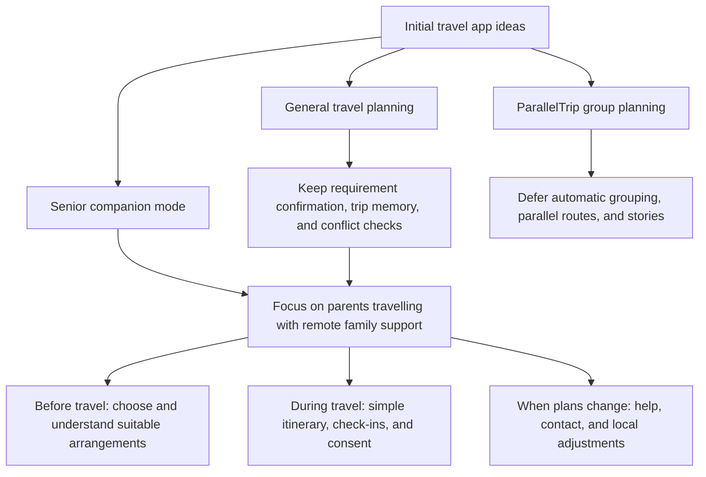
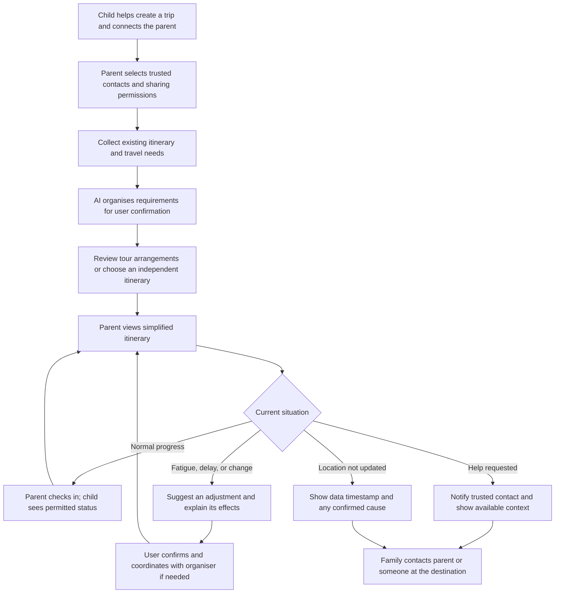
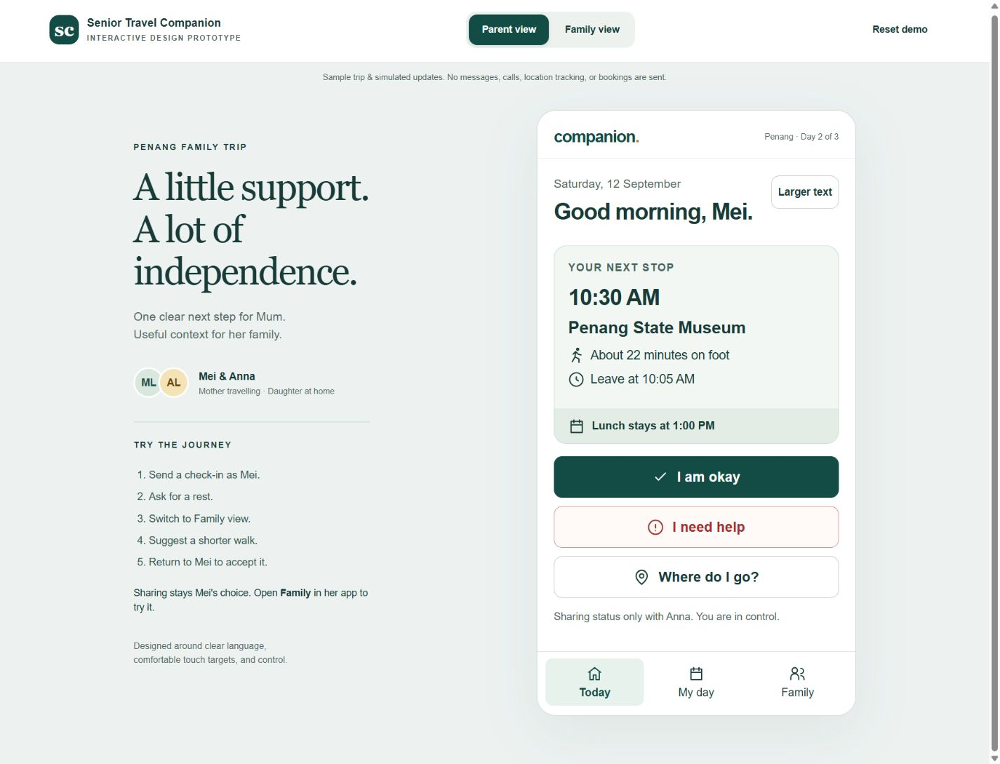
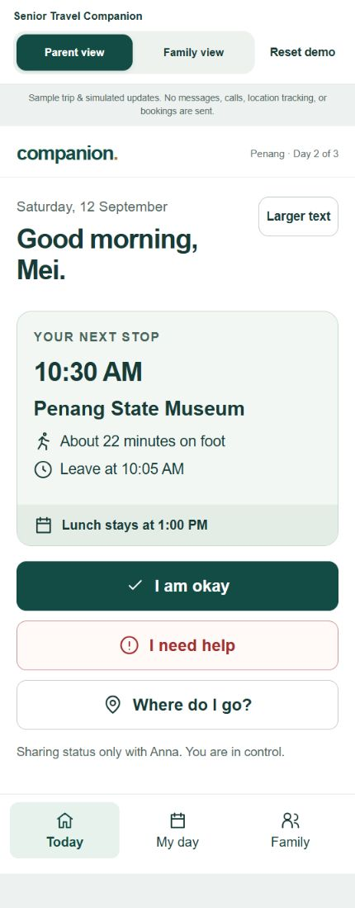
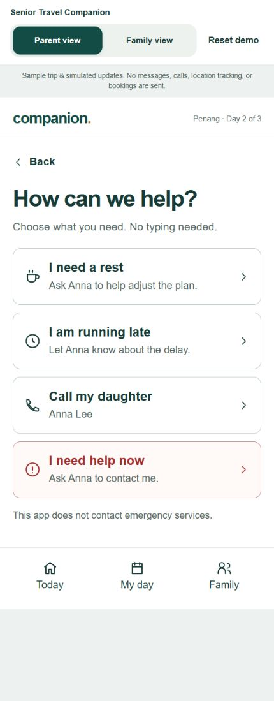
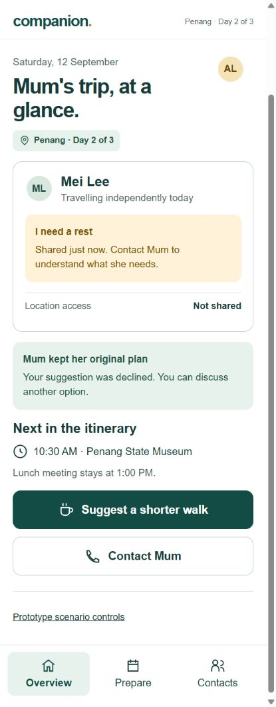
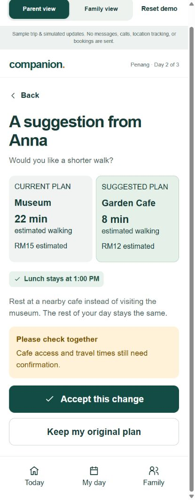
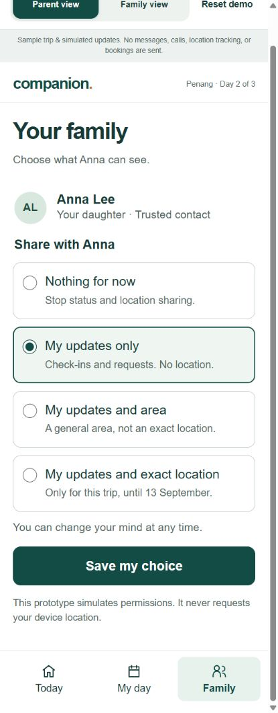
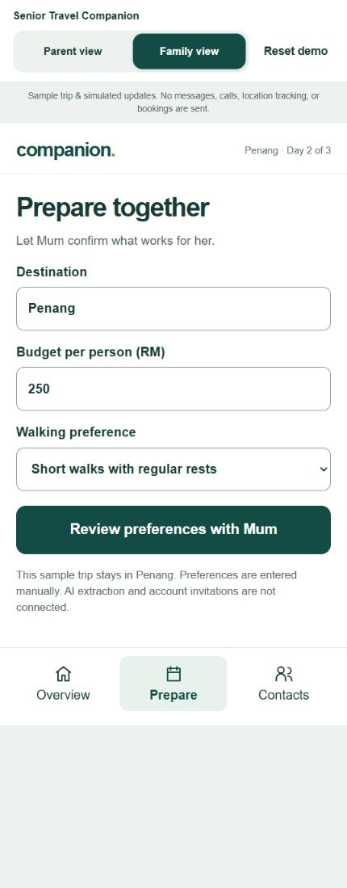

# Senior Travel Companion

A travel assistance app for adult children who cannot personally accompany their older parents on a trip.

This document covers **2. Ideation & Process** and **3. Design & Prototype** from the Submission Template. The product capabilities remain proposals; Section 3 presents a working interface prototype with simulated data. It has not yet been validated with older users.

**Review the design:** [Design and prototype](#3-design--prototype) · [Key screens](#key-screens) · [Reviewer walkthrough](#reviewer-walkthrough)

## 2. Ideation & Process

### Product Direction and Target Users

We want to help adult children support their parents before and during a trip, even when they cannot travel together. Children can help choose suitable arrangements, understand the daily itinerary, and respond when their parents are running late, need rest, or request assistance. Parents may join an organised tour or travel independently.

| Role | Position | Core Needs |
| --- | --- | --- |
| Adult children | Primary users and intended payers | Help select suitable itineraries, understand trip progress, and know how to assist when plans change. |
| Parents aged 60 and above | End users and actual travellers | Understand what to do next, check in or request help easily, and control what information they share. |
| Authorised family members or local contacts | Supporting users, such as siblings, accompanying relatives, or tour organisers | View permitted information and help with communication or issues at the destination. |

A **Trusted Companion** is a contact authorised by the parent. This person may be an adult child helping remotely or someone travelling with the parent. The app must distinguish these roles: it cannot assume that a child is physically present, and creating a trip does not automatically grant access to a parent's location.

**Core question:** How might we help older parents understand and manage their trip while enabling useful remote support from their adult children, with parents remaining in control of their information and decisions?

Our initial problem hypotheses concern whether itineraries suit parents' stamina and preferences, whether complex schedules are difficult to follow, whether families need to repeatedly ask for updates, and whether changes are difficult to communicate. These hypotheses require interviews with parents and adult children.

### 2.1 Ideas We Considered

The initial draft explored general travel planning, ParallelTrip group itineraries, and a senior companion mode. Our current direction centres on Senior Travel Companion, retaining capabilities that directly support parents travelling and families helping remotely. The decisions below reflect this proposed scope.

| Idea | Decision | Reason for Keeping, Adapting, or Deferring |
| --- | --- | --- |
| **Parent travel with remote family support (Chosen)** | Core direction | Serves families who cannot travel together, connecting preparation, trip awareness, and assistance when something changes. |
| **Shared family trip space and authorised contacts (Chosen)** | Keep | Connects parents, children, and relevant contacts to one itinerary, with roles and information permissions managed separately. |
| **AI requirement extraction with user confirmation (Chosen)** | Keep | Organises budget, interests, dietary needs, walking limits, and rest preferences from discussions. Users confirm, edit, or reject suggestions before they become decisions. |
| **Living Trip Memory (Chosen)** | Keep and focus | Distinguishes tentative suggestions, confirmed preferences, hard constraints, rejection reasons, and booked arrangements so revisions respect prior decisions. |
| **Suitable itinerary selection and feasibility checks (Chosen)** | Adapt | Compares walking demands, rest opportunities, transport, costs, and fixed times. For organised tours, focuses on understanding the existing schedule and identifying details to confirm. |
| **Simplified itinerary for parents (Chosen)** | Keep | Highlights the next activity, departure or meeting time, estimated walking time, and clear actions for checking in, requesting help, and contacting family. |
| **Consent-based status and location sharing (Chosen)** | Keep | Parents choose recipients, location precision, and sharing duration, and can stop sharing. Remote assistance relies on explicit permission. |
| **Check-ins and contextual trip status (Chosen)** | Keep | Communicates arrival, wellbeing, delays, or requests for help, with timestamps that make updates understandable. |
| **Help requests and contact actions (Chosen)** | Keep | Lets parents quickly request assistance while authorised contacts see relevant itinerary details and permitted location information. |
| **Route deviation and unavailable location explanations (Chosen)** | Keep for prototype demonstration | Distinguishes possible deviation, stale data, and unavailable location. Simulated GPS can demonstrate the interaction and test how families interpret it. |
| **Minimal-change replanning with before-and-after comparison (Chosen)** | Adapt | Changes affected activities when parents are tired, delayed, or affected by rain, while aiming to preserve bookings, pickups, and meeting times. Users review changes before confirming. |
| Itinerary and check-in reminders | Secondary priority | May reduce forgotten activities or updates. Local reminders can follow once the core journey works. |
| Basic budget tracking and transport cost estimates | Secondary priority | Supports itinerary decisions, but detailed expense management is outside the core scope. Costs must be labelled as estimates. |
| Separate general travel and senior modes | Defer | Focuses the initial experience on one clear family use case. |
| ParallelTrip automatic grouping, Fork Windows, multiple Parallel Tracks, and reunion-point optimisation | Defer | Primarily addresses different interests within groups travelling together. The current use case needs fixed meeting arrangements without depending on parallel group planning. |
| Mandatory accompanying companion for every older traveller | Adapt to individual trip needs | Independent travel is part of the target scenario. Where in-person support is needed, an actual accompanying contact must be arranged rather than assumed. |
| Parallel Story, branching timelines, What You Missed, and shared travel stories | Defer | These support memories and sharing; they can be reconsidered after the remote assistance experience is validated. |
| Public social platform, real payments, hotel and flight booking, and full WhatsApp integration | Exclude from this phase | Adds substantial business and integration scope before the value of family travel assistance has been tested. |
| Automatic emergency dispatch, ambulance calls, medical monitoring, and fall detection | Exclude from product promises | The concept provides travel information, help requests, and contact options. It does not promise automatic rescue or medical assessment. |

#### How the Core Experience Connects

**Before the trip: agree on suitable arrangements.** Adult children help create a trip with its destination, dates, budget, and members. Together with their parents, they confirm interests, dietary needs, walking limits, and rest preferences. AI presents extracted requirements for confirmation before using them in itinerary suggestions. For an organised tour, the family records the existing itinerary and fixed meeting points. For independent travel, the app can propose itineraries for comparison. Budget or timing conflicts should come with understandable alternatives for users to choose from.

**During the trip: parents know what comes next, and children understand the current situation.** The parent's view highlights the next activity, departure or meeting time, and estimated walking time. Actions include "I have arrived", "I am okay", "I am running late", "I need help", and "Call trusted companion". The child's view shows itinerary progress, the latest check-in, update times, and items needing attention. Location appears only within the parent's permissions.

**When plans change: understand the situation and agree on an adjustment.** Parents can report fatigue, delays, or a need for help. The app uses the itinerary to suggest options such as taking a rest, contacting the tour organiser, or returning to a meeting point. It explains changes to activities, walking, estimated costs, and timing before users confirm. Changes affecting an organised tour require coordination with the organiser; editing the app's itinerary does not mean the tour has accepted the change.

#### Consent and Meaningful Status Information

- Parents choose trusted contacts and whether to share status only, approximate location, or precise location. Sharing can be limited to the trip or triggered by route deviation, and parents can stop it.
- "On track", "Check-in due", "Possibly off route", "Running late", "Help requested", and "Location unavailable" represent different situations. Missing location updates must not automatically be interpreted as danger.
- Every status shows its last update time. Causes such as lost connectivity, unavailable GPS, low battery, or stopped sharing are identified only when supported by available information. Otherwise, the app states that the cause is unknown or the data is stale.
- A help request shows the current itinerary, next meeting point, and last known location when available and authorised. Contact options help the family act without implying that emergency services have been notified or dispatched.
- Suggested routes may prioritise shorter walks, rest stops, fewer stairs, and nearby toilets. Accessibility information must include its source or be marked as requiring confirmation; AI inference alone cannot guarantee accessibility.

### 2.2 Ideation Boards

The following diagrams organise the draft ideas and current product direction. They illustrate the proposed concept and user journey rather than completed workshops or user testing. Both diagrams are embedded in this Markdown file using Mermaid.

#### From Initial Ideas to a Focused Concept

This diagram shows how the broader travel concept narrows to families who cannot travel together. General planning capabilities support the senior experience, while parallel group planning remains deferred.

#### Family Support User Journey

The journey distinguishes routine check-ins, changed plans, explicit help requests, and missing location updates. Adult children assist remotely; action at the destination requires contact with the parent or someone physically present.

#### Example of a Local Itinerary Adjustment

A parent feels tired and wants to rest nearby while keeping a 1:00 PM lunch meeting. The figures below are illustrative values from the concept draft, not verified venue information or live prices.

| Item | Original Plan | Proposed Adjustment |
| --- | --- | --- |
| Activity | Visit a museum | Rest at a nearby cafe; suitability for the parent requires confirmation. |
| Estimated walking time | 22 minutes | 8 minutes |
| Estimated activity cost | RM15 | RM12 |
| Lunch meeting time | 1:00 PM | 1:00 PM, subject to checking transport and arrival time. |

The app should explain why it suggests the adjustment, which arrangements remain in place, and what still needs confirmation. For organised tours, the family coordinates with the organiser before updating the parent's confirmed itinerary.

#### Initial Prototype Validation

The first prototype should demonstrate one complete trip journey: requirement confirmation, a simplified itinerary, authorised sharing and check-ins, a help request or simulated route deviation, and confirmation of a local adjustment. We will first test whether both generations can understand and use this experience before expanding into budget tools, reminders, or other features.

| Question to Validate | Proposed Method |
| --- | --- |
| Can parents independently find their next activity, check in, and request help? | Ask parents to complete specific tasks and observe whether they need explanation or assistance. |
| Can children distinguish a missed check-in, stale location, and a help request? | Present different status scenarios and ask what each means and what action they would take. |
| Do parents understand and accept sharing controls? | Ask parents to select recipients, precision, and duration, then stop sharing. |
| Does AI accurately capture requirements and preserve important constraints? | Use a discussion containing tentative suggestions and confirmed decisions to test confirmation, editing, and replanning. |
| Does the support model fit both organised tours and independent travel? | Interview families with experience of each, checking which arrangements can change and whom they need to contact. |
| Would adult children continue using or pay for the app? | Explore travel frequency, current support methods, and willingness to pay. Intended payers are not yet validated customers. |

### 2.3 Mentor Consultation

Mentor consultation records are pending. The table below will be completed with actual feedback and resulting decisions.

| Date | Mentor | Feedback Received | What Was Changed |
| --- | --- | --- | --- |
| Pending | Pending | Record actual feedback after consultation. | Record changes made, or explain why feedback was not adopted. |

Consultation should explore whether the family use case is focused enough, whether the parent experience is simple, whether remote and in-person responsibilities are clear, and whether the initial prototype scope is feasible.

## 3. Design & Prototype

### Design Intent

**Parents see the next step. Their children handle the planning detail.** The parent's home screen answers three questions: Where am I going? When should I leave? How much walking is involved? Checking in takes one tap from that screen. Asking for rest takes two taps and requires no typing.

The design uses large text, clearly labelled actions, generous spacing, and a consistent three-item navigation: **Today**, **My day**, and **Family**. Parents retain control of sharing and can accept or decline itinerary suggestions. The interface uses English throughout.

The desktop preview places a demonstration guide beside the app. On a phone, the guide disappears and the app occupies the available width. The role switch and simulation notice belong to the prototype presentation, not the proposed parent's everyday interface.

### Open the Interactive Prototype

**Prototype entry file:** [prototype/index.html](prototype/index.html)

Download or clone this repository, then open `prototype/index.html` in a browser. Keep `index.html`, `styles.css`, and `app.js` together in the `prototype` folder. No installation, account, or API key is needed. GitHub displays HTML as source, so use the downloaded file to interact; the screenshots below can be reviewed directly on GitHub.

The prototype is local and has no public deployment URL. State is shared between the two preview roles within the same page and resets on refresh or **Reset demo**. It does not synchronise separate devices.

### How Users Operate the App

| Stage | Parent's Actions | Adult Child's Actions |
| --- | --- | --- |
| Prepare | Review preferences together; choose what to share. | Enter a budget and walking preference, review with the parent, and confirm. |
| Start the day | Open Today to see the next place, departure time, and walking estimate. | Open Overview to see the plan and available updates. |
| Check in | Tap **I am okay** and read the confirmation. | See the update in Family view, without requiring location access. |
| Need assistance | Tap **I need help**, then choose rest, delay, or contact. | Read the actual request and contact the parent when needed. |
| Adjust the itinerary | Review Anna's suggestion; accept it or keep the original plan. | Suggest a shorter walk and wait for the parent's decision. |
| Manage privacy | Open **Family**, choose a sharing level, and save. | See only the status and location information permitted by the parent. |

### Key Screens

These are screenshots of the implemented interface, not generated mockups. All names, times, venue details, and travel estimates are demonstration data. Select an image to inspect it at full size.

| 01 · Parent home | 02 · Ask for help |
| --- | --- |
|  |  |
| The next stop is prominent. **I am okay** needs one tap, with a visible confirmation. | Parents select familiar phrases instead of composing a message. Call actions are previews only. |

| 03 · Family overview | 04 · Parent reviews a suggestion |
| --- | --- |
|  |  |
| The family sees the meaning of an update and respects a declined suggestion. A location is not required for a rest request. | The parent compares walking and cost estimates. The lunch meeting is preserved, and either decision is available. |

| 05 · Sharing choices | 06 · Prepare together |
| --- | --- |
|  |  |
| Full-row choices explain what Anna can see. Selecting an option does not save it until the parent presses **Save my choice**. | The family handles form entry. A separate review step precedes confirmation; the sample destination is fixed to Penang. |

### Reviewer Walkthrough

1. Open the prototype and select **Reset demo**. The page starts in **Parent view** as Mei.
2. Press **I am okay**. A confirmation appears. Select **Family view** to see the same check-in as Anna.
3. Return to **Parent view**. Select **I need help**, then **I need a rest**. The confirmation distinguishes sharing a request from the recipient having read it.
4. Select **Family view**, then **Suggest a shorter walk**. Review the museum-to-cafe comparison and select **Send suggestion to Mum**.
5. Return to **Parent view**, select **Anna suggested a change**, then **Accept this change**. The next activity updates to Garden Cafe. Alternatively, select **Keep my original plan** and inspect the declined status in Family view.
6. In Parent view, open **Family**, choose **Nothing for now**, and save. Family view now states that sharing is off instead of showing current personal updates.
7. Select **Reset demo** to try a separate scenario. In Family view, expand **Prototype scenario controls** and choose an old location update or an offline parent. These controls explicitly create fictional conditions for review.

Additional exploration: select **Prepare** in Family view to edit and confirm preferences. Select **Larger text** on the parent's home screen to move through 120%, 200%, and standard app text sizes.

### Design Research and Its Application

The design draws on accessibility standards and published usability research rather than treating all older adults as having the same abilities. These sources inform design decisions; they do not replace usability testing with our target families.

| Evidence or Guidance | Application in This Prototype |
| --- | --- |
| [W3C WAI: Older Users and Web Accessibility](https://www.w3.org/WAI/older-users/) describes overlapping needs involving vision, motor control, and cognition. | A clear next activity, familiar action labels, spacious controls, and stable navigation reduce effort without removing the parent's choices. |
| [Nielsen Norman Group: Usability for Older Adults](https://www.nngroup.com/articles/usability-for-senior-citizens/) reports research with older users and identifies problems such as small targets and difficult-to-read interfaces. | The parent experience avoids icon-only actions, hidden gesture controls, and typing for common assistance requests. |
| [WCAG 2.2, SC 2.5.5: Target Size Enhanced](https://www.w3.org/WAI/WCAG22/Understanding/target-size-enhanced.html) specifies 44 by 44 CSS pixels, subject to exceptions, at Level AAA. | The three primary home actions are at least 60px high. The text-size control is 48px high, and sharing choices use large clickable labels. These are product choices, not a claim of full AAA conformance. |
| [WCAG 2.2, SC 1.4.3: Contrast Minimum](https://www.w3.org/WAI/WCAG22/Understanding/contrast-minimum.html) requires at least 4.5:1 for ordinary text and 3:1 for qualifying large text. | Measured token pairs include white on the primary green at 9.79:1, body text on white at 12.21:1, and secondary text on white at 6.04:1. Statuses also use words, not colour alone. |
| [WCAG 2.2, SC 1.4.4: Resize Text](https://www.w3.org/WAI/WCAG22/Understanding/resize-text.html) addresses text enlargement up to 200% without losing content or functionality. | Parent app text starts at 20px with relative sizing and can be enlarged to 40px. Layouts wrap instead of requiring fixed-height text containers. |

The 20px starting size and 60px primary buttons are our design decisions; WCAG does not prescribe a universal body font size. The dark green identifies primary actions, while a red label and border distinguish assistance. Neither colour is the only cue. Controls use native buttons and form elements, visible keyboard focus, and live status announcements.

### Validation and Current Limits

| Check | Result |
| --- | --- |
| Check-in and rest request | Clicked through both roles; the family sees the simulated update. |
| Accept or decline an itinerary suggestion | Both paths checked. Acceptance updates the parent itinerary; declining preserves it. |
| Arrival check-in | The confirmation preserves **I have arrived** rather than converting it to a generic wellbeing message. |
| Stop sharing | Family overview shows sharing off and hides current status and location. |
| Offline and stale-location scenarios | Offline check-ins do not report success. Old location data shows its timestamp and an unknown cause. |
| Preparation | Edited the budget, reviewed it, and confirmed that the family overview reflects the saved preference. |
| Responsive layout | Inspected mobile layouts at 320px, 390px, and 430px widths and a desktop layout at 1440px. |
| Text enlargement | Checked parent home, help, and sharing at 200% app text on a 320px viewport, with no horizontal overflow detected. |
| Basic technical checks | JavaScript syntax checked; inspected browser logs contained no warnings or errors during the checked session. |

This is a functional interface demonstration, not a deployed travel service or a completed accessibility audit. AI extraction, real notifications, calls, GPS, route deviation detection, navigation, accounts, bookings, and cross-device synchronisation are not connected. The offline control simulates an unavailable connection; it is not an offline caching implementation. The sample clock and itinerary do not advance automatically. Accessibility, travel-time, and cost information still needs verification for real trips.

Next, test the core tasks with parents aged 60+ and adult children: finding the next activity, checking in, requesting rest, declining a change, and stopping sharing. Observe assistance needed, mistaken taps, task completion, and understanding of status messages before claiming that the design is easy for this audience.
